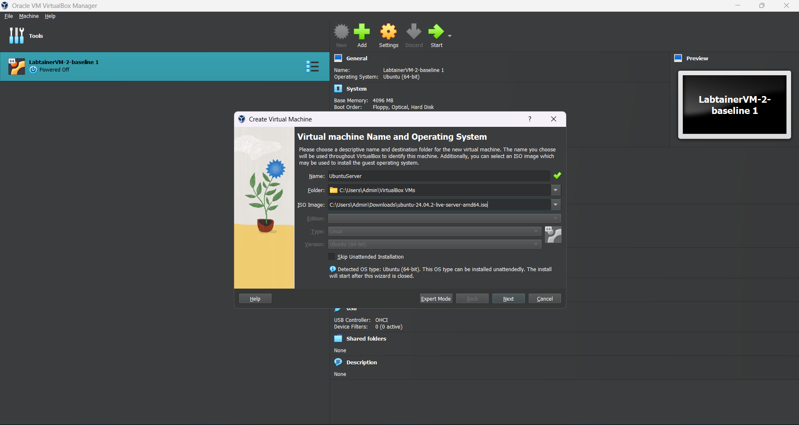
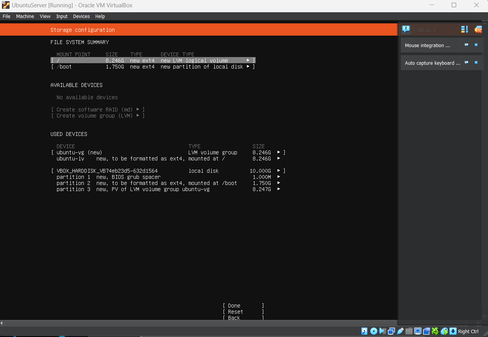
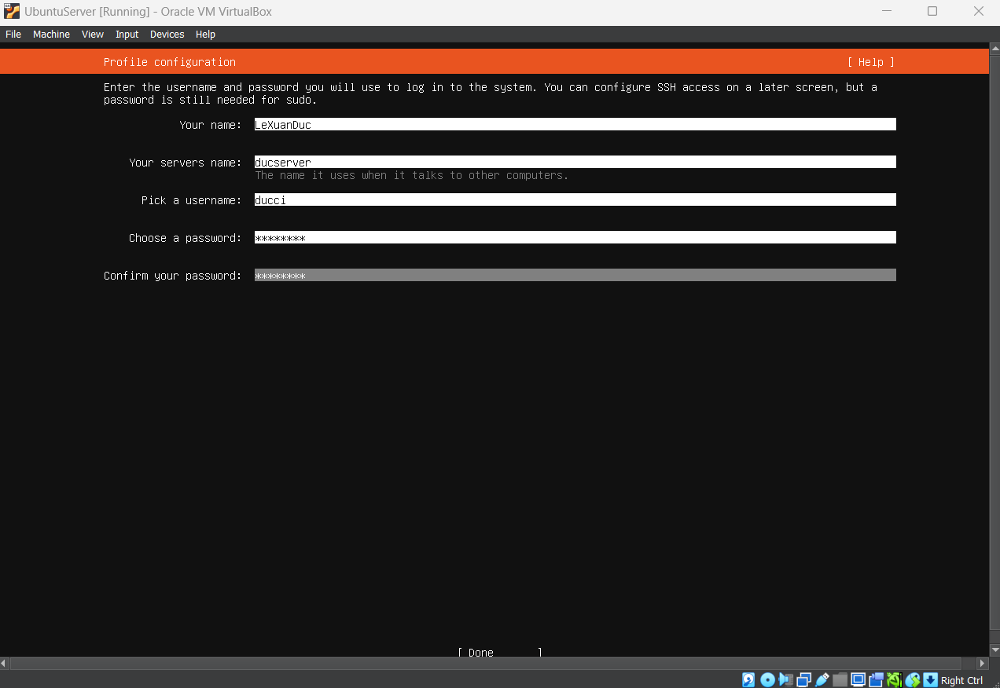

# Oracle VM VirtualBox Ubuntu Server
1. [Overview](#overview)

2. [Install Oracle VM Virtual Box](#install)

3. [Install Ubuntu Server](#install2)

4. [Create a New Virtual Machine and attach Ubuntu Server](#virtualmachine)

5. [Setup Ubuntu Server](#setup)

6. [Connect SSH Server](#connectssh)
<a name="overview"></a>
## 1. Overview
Oracle VirtualBox is a cross-platform virtualization application. That means it
extends the capabilities of your existing computer so that it can run multiple
operating systems, inside multiple virtual machines (VMs), at the same time. As an
example, you can run Windows and Linux on your Mac, run Windows Server on
your Linux server, run Linux on your Windows PC, and so on, all alongside your
existing applications. You can install and run as many virtual machines as you
like. The only practical limits are disk space and memory.
Oracle VirtualBox is deceptively simple yet also very powerful. It can run
everywhere from small embedded systems or desktop class machines all the way
up to data center deployments and even Cloud environments.

### Features
- Portability

- Guest Additions: shared folders, seamless windows, 3D virtualization

- Comprehensive hardware support

- Multigeneration branched snapshots

- VM groups

- Clean architecture and unprecedented modularity

- Remote machine display

### Available Installation Packages

x86-64 Windows hosts:

- Windows 11

- Windows 10

- Windows Server 2025

- Windows Server 2022

Intel x86-64 macOS hosts:

- 14 (Sonoma)

- 13 (Ventura)

- 12 (Monterey)

- 11 (Big Sur)

See also Known Limitations.

- Arm macOS hosts (64-bit):
- 14 (Sonoma)

- 13 (Ventura)

- 12 (Monterey)

- 11 (Big Sur)

Ubuntu Server is a popular open-source operating system specifically designed for server environments. It is based on the broader Ubuntu Linux distribution but tailored to meet the needs of servers rather than desktops. Here's a brief overview:

### Key Features
- Lightweight and Efficient: Ubuntu Server is optimized to run on a wide range of hardware, from high-powered servers to low-resource devices.

- Security-Focused: It includes regular updates, built-in firewall tools (like ufw), and robust security features.

- LTS Versions: Ubuntu Server offers Long Term Support (LTS) releases that receive five years of updates, making it reliable for long-term deployments.

- Flexible: It supports a variety of server technologies, such as web servers (Apache, Nginx), database systems (MySQL, PostgreSQL), and virtualization.

- Cloud-Ready: Ubuntu Server is widely used in cloud environments and is compatible with major platforms like AWS, Microsoft Azure, and Google Cloud.

- Community and Support: With a large user community, official Canonical support, and extensive documentation, it's easy to find help when needed.

### Common Use Cases
- Web Hosting: Runs web servers for hosting websites and applications.

- Database Servers: Manages data storage and retrieval using databases like MySQL or MongoDB.

- File Sharing: Acts as a file server using protocols like NFS or Samba.

- Containers and Virtualization: Supports Docker, Kubernetes, and other containerization tools.

- Cloud Services: Powers cloud instances in public and private cloud infrastructures.

Mail Servers: Hosts email services with software like Postfix and Dovecot.

<a name="install"></a>
## 2. Install Oracle VM Virtual Box

### Host System Requirements

**Processor:** Any recent Intel or AMD processor should work.

**Memory (RAM):** At least 512 MB is required, but more is recommended depending on the guest operating system.

**Hard Disk Space:** VirtualBox itself requires minimal space (around 30 MB), but you'll need additional space for the virtual machines. Plan for several GBs depending on the guest OS.

**Supported Host Operating Systems:** VirtualBox supports Windows, macOS, Linux, and Oracle Solaris.

### Install Oracle VM VirtualBox
Download Oracle VM VirtualBox from the [official website](https://www.virtualbox.org).

Install it by following the on-screen instructions for your operating system.

<a name="install2"></a>
## 3. Install Unbuntu Server
Download the Ubuntu Server ISO
Go to the Ubuntu [website](https://ubuntu.com/download/server) and download the latest Ubuntu Server ISO file.

<a name="virtualmachine"></a>
## 4. Create a New Virtual Machine and attach Ubuntu Server

- Open VirtualBox and click New to create a new virtual machine. Name your VM (e.g., "UbuntuServer") and select the download ISO file of Ubuntu Server



- Configure the Unattended guest OS install setup


- Configure the hardware resources (1GB RAM and 1 CPU is recommended but more is better for performance)


- Configure hard disk space (10GB minimum)


- Review everything then press Finish 

Once click on Finish, Oracle VM will automatically turn on Ubuntu Server

<a name="setup"></a>
## 5. Setup Ubuntu Server

Follow the on-screen instructions to install Ubuntu Server. You'll need to:

- Select your language and keyboard layout.


- Install Ubuntu Server


- Configure network


- Configure Storage



Once click Done and Continue

- Set up user credentials (username, password).


- Select and install software as required (e.g., OpenSSH Server for remote access).


- Install any necessary snaps (optional)


Press Done and wait for the system installation
Once Complete, reboot the system

After reboot, enter your username and password to enter Ubuntu Server

<a name="sshconnect"></a>
## 6. Connect SSH server on Ubuntu Server

After enter username and password

### Ensure SSH is Installed on the Server
If you installed the OpenSSH Server during the Ubuntu Server setup, SSH should already be enabled.

If not, you can install it with the following command:
```sh 
sudo apt update
sudo apt install openssh-server
```

### Find Your Server's IP Address

Log in to your server directly and check the IP address using:

```sh 
ip addr
```
Look for the IP under the inet section of the network interface (e.g., eth0 or ens33).

### Use an SSH Client on Your Local Machine
Linux/macOS: Use the terminal.

Windows: Use the built-in SSH client in Command Prompt, PowerShell, or apps like PuTTY.

### Connect to the Server
Open a terminal or SSH client and run:
```sh 
ssh username@server-ip
```
Replace username with the user you created during server installation and server-ip with the IP address of your server.

### Accept the Server's Key Fingerprint
On your first connection, you'll be asked to confirm the server's fingerprint. Type yes to proceed.

### Enter the Password
Enter the password you set for the user during installation. After this, you'll be logged into the server.

